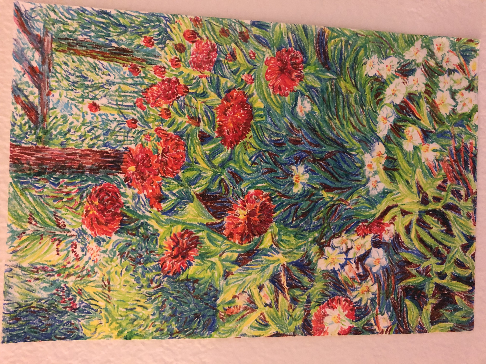
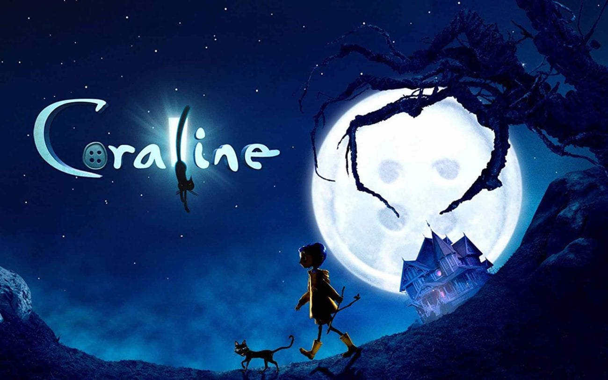

### Intro
My name is Yueqi Wang, and I am a Computer Engineering major at UCSD. Here is my [Linkedin](https://www.linkedin.com/in/yueqi-wang-627561181/)

### Skills
- C++
- Verilog
- Java
- Python

### Schedule
- [] CSE141L
- [] CSE141
- [] CSE110
- [] CSE167

### Hobbies
- Drawing (*I like water color in particular*)
- Binging Shows and Movies (*I recommend the Good Place*)





### Random
Here is something you could do in C++, that I always forget

```
bool y = true;
bool z = false;
int x = (y==z)?1:0;
```

That's all, to quote Micheal from *the Good Place*
>Take it sleazy
